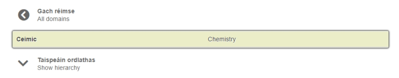

# Browse

All database entries are linked to at least one domain. The Browse tab contains an alphabetical list of the main domains (or subject-fields) into which entries are organised. This list can be sorted alphabetically by English or by Irish.

If you click on any of the main domains shown in the list you will receive a list of all entries linked to that domain. Most main domains incorporate a hierarchy of sub-domains which can be viewed and browsed by clicking on the ‘Show hierarchy’ button.

téarma.ie uses a modified version of the DANTERM domain classification system for the organisation of its entries. The DANTERM domain classification was created by *DANTERMcentre*, the centre for terminology at Copenhagen Business School. This hierarchical classification system consists of a number of macro-units that are sub-divided into micro-units. More finely grained ontologies have been added in specific areas like biology and sports.

