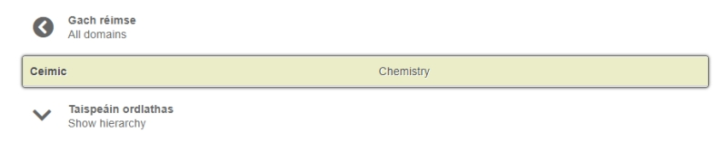

# Brabhsáil

Tá gach iontráil sa bhunachar nasctha le réimse amháin, ar a laghad. Tá liosta aibítreach faoin táb ‘Brabhsáil’ de na príomhréimsí faoina bhfuil na hiontrálacha aicmithe. Is féidir an liosta seo a shórtáil de réir ord aibítreach na Gaeilge nó ord aibítreach an Bhéarla.

Má chliceálann tú ar cheann de na príomhréimsí sa liosta seo gheobhaidh tú liosta de gach iontráil atá luaite leis. Bíonn sraith foréimsí faoi bhun gach príomhréimse, go hiondúil, agus is féidir iad seo a fheiceáil agus a bhrabhsáil ach cliceáil ar an gcnaipe ‘Taispeáin ordlathas’. 

Tá **córas réimsí** i bhfeidhm i mbunachar téarma.ie ar leagan leasaithe é de chóras aicmiúcháin réimsí DANTERM arna chruthú ag *DANTERMcentre*, ionad téarmaíochta Scoil Ghnó Chóbanhávan. Sa chóras seo tá líon áirithe móraonad atá roinnte ina mionaonaid. Tá ointeolaíochtaí níos mionsonraithe curtha le roinnt de na mionaonaid i réimsí cosúil le zó-eolaíocht agus spóirt.
