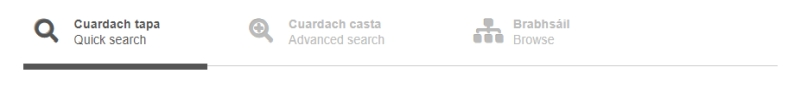

# Conas an suíomh a úsáid

Tá trí bhealach éagsúla chun an bunachar a cheadú. Is féidir teacht orthu ó na táib ag barr an scáileáin:

- [Cuardach Tapa](/): bealach gasta é seo chun téarma a aimsiú, i nGaeilge nó i mBéarla, fiú mura bhfuil an téarma iomlán ar eolas agat.
- [Cuardach Casta](/plus/): an bnuachar a chuardach de réir sainchritéar, mar shampla de réir tús nó deireadh focail nó de réir réimse.
- [Brabhsáil](/dom/ga/): iontrálacha a bhrabhsáil de réir réimse.
