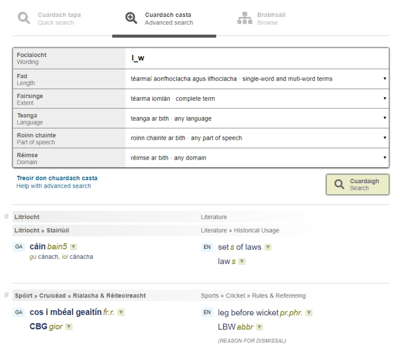

# How to use advanced search

Unlike the Quick Search, the Advanced Search lists only those terms that satisfy the search criteria exactly. For example, if you search for **smoked**, you will find the term **smoked**, but you will not find a link to the term **smoke** – although it is in the database. This search does not disregard punctuation. If you search for **rain-forest** (with a hyphen), you will not find it as the database only contains **rain forest** (without a hyphen). Neither of the searches is case-sensitive, however – so whether you enter ***téarma*** or ***TÉARMA*** (or even ***TéArMa***) you will get the same results.

The following criteria can be used individually or in combination to narrow your search results:

## Length (single-word/multi-word)

This criteria allows you to limit your search to either single-word or to multi-word terms. The default option includes both.

## Extent

This criteria allows you to limit your search to terms beginning with, ending with or incorporating a particular word or string of characters.

## Language

This criteria allows you to limit your search results to a particular language. The default option includes terms from all languages. 

## Part of speech

This criteria allows you to limit your search results to a particular part of speech. For example, you can request a list containing nouns only.

## Domain

This criteria allows you to limit your search results to a particular domain. For example you could search the word ‘bat’ and restrict your results to the ‘Sports’ domain, thus filtering out results relating to nocturnal flying mammals.

## Combining Criteria

You can select any combination of the above criteria for your search. The search engine will return terms which satisfy all of those criteria selected. 

If your search yields no result, you may have selected criteria that are too narrow. In that case, it is worth looking back on your criteria 
and broadening them in some way.

# Wildcards in advanced search

A clever way to make your Advanced Search more flexible is to use wildcards in the 'Foclaíocht/Wording' box. A wildcard is a symbol which stands for one or more unspecified characters. These are the available wildcards:

## Underscore: _

This represents any single character. For example, if you search for **l_w**, you will find **law** and **low**, as well as the abbreviations **LBW** and **LLW**.

## Percentage: %

This represents any number (including zero) of any characters. For example, if you search for **met%rology**, you will find **metamorphic petrology** and **meteorology**, as well as **metrology**. This wildcard, when used on its own, will produce a list of every entry that satisfies the selected search criteria.

