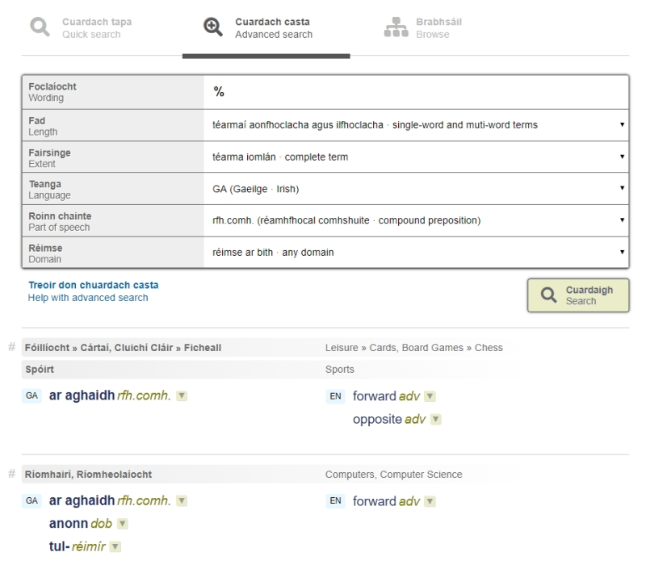

# Conas an Cuardach Casta a úsáid

Murab ionann agus an Cuardach Tapa, tugann an cuardach seo na téarmaí siúd a chomhlíonann na critéir a roghnaigh tú go díreach, agus ní thugann sé aon téarmaí eile. Mar shampla, má chuardaíonn tú an téacs ***smoked***, gheobhaidh tú an téarma ***smoked***, ach ní bhfaighidh tú aon nasc chuig an téarma ***smoke*** – cé gurb ann dó sa bhunachar. Chomh maith leis sin, ní dhéanann an cuardach seo neamhaird de chúrsaí poncaíochta. Mar sin, má chuardaíonn tú ***rain-forest*** (le fleiscín), ní bhfaighidh tú é mar níl sa bhunachar ach ***rain forest*** (gan fleiscín). Rud amháin atá i gcoiteann ag an dá chuardach, áfach, nach bhfuil ceann ar bith acu cásíogair – mar sin, is cuma cé acu **téarma** nó **TÉARMA** (nó fiú **TéArMa**) a scríobhann tú, gheobhaidh tú na torthaí céanna.

Is féidir na critéir seo a leanas a úsáid chun torthaí do chuardaigh a theorannú:

## Fad (aonfhoclach/ilfhoclach)

Is féidir do thorthaí cuardaigh a theorannú do théarmaí aonfhoclacha amháin nó do théarmaí ilfhoclacha amháin. Tugtar an dá chineál téarma faoin gcuardach réamhshocraithe.

## Fairsinge

Is féidir do thorthaí cuardaigh a theorannú do théarmaí dar tús, dar críoch nó do théarmaí a chuimsíonn focal no sraith carachtar áirithe. 

## Teanga

Is féidir do thorthaí cuardaigh a theorannú do theanga ar leith. Bíonn téarmaí ó gach teanga san áireamh faoin gcuardach réamhshocraithe.

## Roinn chainte

Is féidir do thorthaí cuardaigh a theorannú do roinn chainte ar leith.  Mar shampla is féidir liosta a iarraidh nach mbeidh air ach ainmfhocail, nó nach mbeidh air ach réimíreanna.

## Réimse

Is féidir do thorthaí cuardaigh a theorannú do réimse ar leith. Mar shampla, d’fhéadfá an focal Béarla ***bat*** a chuardach agus na torthaí cuardaigh a theorannú don réimse ‘Spóirt’. Chuirfeadh sé sin liosta fada téarmaí as an áireamh a bhfuil mamach eitilte oíche luaite iontu.

## Teaglamaí de chritéir

Is féidir teaglaim ar bith de chritéir a roghnú agus cuardach á dhéanamh agat. Liostaíonn an t-inneall cuardaigh téarmaí a chomhlíonann na critéir sin go léir.

Más rud é nach bhfaigheann tú aon torthaí ar do chuardach, seans go bhfuil critéir róchúnga roghnaithe agat. Sa chás sin, is fiú féachaint siar ar na critéir agus iad a leathnú amach ar bhealach éigin.

# Saoróga sa Cuardach Casta

Bealach cliste chun solúbthacht a chur leis an gCuardach Casta is ea saoróga a úsáid sa bhosca 'Foclaíocht/Wording'. Is éard is saoróg ann siombail a sheasann do charachtar (nó sraith carachtar) neamhshonraithe eile. Seo iad na saoróga is féidir a úsáid:

## An fhostríoc: _

Seasann sí seo do charachtar aonair ar bith. Mar shampla, má lorgaíonn tú ***l_w***, gheobhaidh tú ***law*** agus ***low***, chomh maith leis na giorrúcháin ***LBW*** agus ***LLW***.

## An céatadán: %

Seasann sé seo do líon ar bith (náid san áireamh) de charachtair ar bith. Mar shampla, má chuardaíonn tú **met%rology**, gheobhaidh tú ***metamorphic petrology*** agus ***meteorology***, chomh maith le ***metrology*** féin. Nuair a usáidtear an tsaoróg seo léi féin sa 'Cuardach Casta', gintear liosta de gach iontráil a chomhlíonann na critéir chuardaigh.

