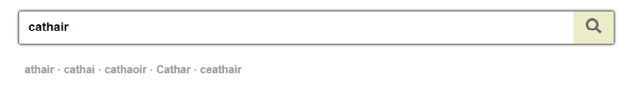

# Quick Search

To search for a term, enter it in the search box. You don’t need to specify a language. The search is not case-sensitive i.e. it doesn’t matter if you write **term** or **TERM** (or even **TeRm**), you will get the same results.

When you search for a term, 'Exact matches' will be listed first and underneath those you will see 'Related matches' - that is every multi-word term in the database which contains the term you entered. The search related terms work on the word level. For example, if you search **verse**, you will find **free verse** and **verse dialogue** among the 'Related matches', but you won’t find **adverse** or **overseas**.

## Similar words

When you search for a word, you will see a short list of similarly spelt words directly under the search box. This feature can help if you have made a spelling mistake or if you don’t know the term’s correct spelling.

## Inflected forms

Inflected forms of terms are stored in the database and it uses this information to find related terms in every search. For example, if you search for the term ***monarcha***, under 'Related matches' you will see every term which contains the word ***monarcha*** or any of its inflected forms (***monarchan***, ***monarchana***), with or without lenition (*séimhiú*): ***limistéar monarchana***, ***feirmeoireacht mhonarchan***, and so on.

## Punctuation

The search process ignores punctuation marks, including hyphens. For example, it doesn’t matter whether you write **lesser-used** or **lesser used**, you will get the same results.

## Compound words

The English language contains many terms which can be written as compound words or as multi-word terms, with or without a hyphen, such as **rain forest/rainforest**, **toothpick/tooth-pick**. The Quick Search takes this into account. If you enter one of the forms, the search engine will suggest the other forms as well, provided they exist in the database. For example, if you search for **tooth-pick**, you will not find it because no such term exists in the database, but the compound word **toothpick** will be given to you instead. This works in the opposite direction as well: if you look for the compound word **rainforest**, the search engine will give you **rain forest**.

## Words that exist in both languages

If you enter a word like ***bean*** or ***seal*** which is found in both languages (but often with different meanings and pronunciation) you will see results in both languages among the 'Exact matches'. You can limit the results to an individual language by clicking on ‘Irish only’ or ‘English only’ in the panel to the right of the search results.

