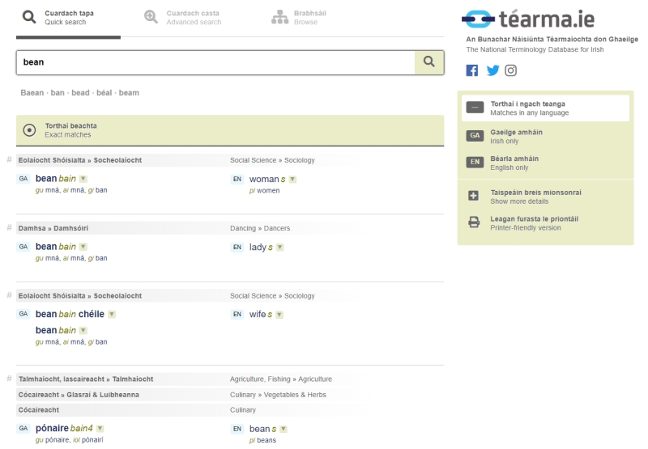

# An Cuardach Tapa

Chun téarma a chuardach, scríobh isteach é sa bhosca cuardaigh. Ní gá duit a chur in iúl cén teanga atá á hionchur agat. Níl an cuardach cásíogair – is é sin le rá, is cuma cé acu **téarma** nó **TÉARMA** (nó fiú **TéArMa**) a scríobhann tú, gheobhaidh tú na torthaí céanna.

Nuair a chuardaíonn tú téarma, liostófar 'Torthaí beachta' ar dtús agus thíos fúthu sin, feicfidh tú 'Torthaí gaolmhara' - is é sin gach téarma ilfhoclach sa bhunachar a bhfuil an téarma a chuardaigh tú féin mar chuid de. Oibríonn cuardach na dtéarmaí gaolmhara ag leibhéal na bhfocal aonair. Mar shampla, má chuardaíonn tú ***verse***, gheobhaidh tú ***free verse*** agus ***verse drama*** i measc na dtéarmaí gaolmhara, ach ní bhfaighidh tú ***adverse*** nó ***overseas***.

## Focail chosúla

Liostaítear focail chosúla díreach faoin mbosca cuardaigh. Seo iad focail eile sa bhunachar atá cosúil ó thaobh litrithe de leis an méid a scríobh tú isteach. D’fhéadfadh sé seo a bheith ina chuidiú má dhéanann tú botún litrithe nó mura bhfuil an litriú ceart ar eolas agat.

## Foirmeacha infhillte

Tá foirmeacha infhillte na dtéarmaí stóráilte sa bhunachar agus úsáidtear an t-eolas seo chun téarmaí gaolmhara a aimsiú ar gach cuardach. Mar shampla, má lorgaíonn duine an téarma **monarcha**, liostófar faoi 'Torthaí Gaolmhara' gach téarma a bhfuil an focal **monarcha**, nó aon fhoirm infhillte de (**monarchan**, **monarchana**), le séimhiú nó gan, mar chuid de: **limistéar monarchana**, **feirmeoireacht mhonarchan**, agus eile.

## Poncaíocht

Déanann an próiseas cuardaigh neamhaird de chomharthaí poncaíochta ar nós an fhleiscín. Mar shampla, is cuma má scríobhann tú ***lesser-used*** nó ***lesser used***, gheobhaidh tú na torthaí céanna.

## Comhfhocail

Tá roinnt focal sa Bhéarla ar féidir iad a scríobh mar chomhfhocail nó mar théarmaí ilfhoclacha, le fleiscín nó gan fleiscín. Cuir i gcás ***rain forest/rainforest***, ***toothpick/tooth-pick***. Aithníonn an Cuardach Tapa gur mar seo atá. Má scríobhann tú ceachtar foirm, déanfaidh an t-inneall cuardaigh na foirmeacha eile a thairiscint duit comh maith, más ann dóibh sa bhunachar. Mar shampla, má chuardaíonn tú ***tooth-pick***, ní bhfaighidh tú é mar níl a leithéid de théarma sa bhunachar, ach gheobhaidh tú an comhfhocal ***toothpick***. Oibríonn sé seo sa treo eile chomh maith: má chuardaíonn tú an comhfhocal ***rainforest***, gheobhaidh tú ***rain forest***.

## Focail atá sa dá theanga

Má scríobhann tú focal i dteanga amháin arb ionann an leagan scríofa de agus focal eile sa teanga eile, mar shampla ***bean*** or ***seal***, gheobhaidh tú torthaí sa dá theanga. Is féidir na torthaí a theorannú do theanga amháin ach cliceáil ar ‘Gaeilge amháin’ nó ‘Béarla amháin’ sa bhosca ar dheis.

