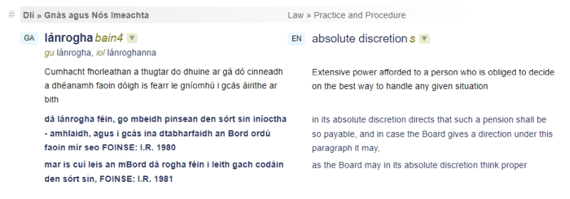
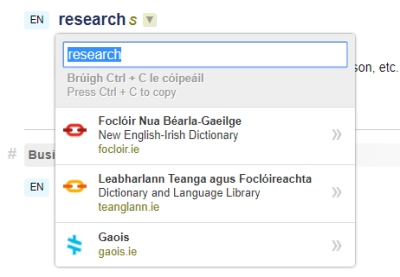
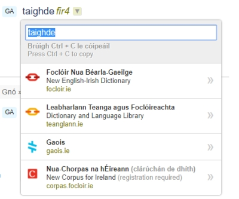

# Understanding search results

Search results take the form of a list of concepts (or entries). *Exact matches* are entries in which the exact search string is to be found as one of the terms used to designate a concept. *Related matches* are entries in which the search term is found as an element of a multi-word term.

## Entry layout

Each entry is delimited by a domain. The domain information is listed first, above the term field. Further information relating to the meaning of the concept (such as definitions and usage examples) is listed underneath the term field where available.

Each entry has a hash symbol in its top left hand corner. Clicking on this takes you to the individual URL for the entry.

## More details

Some entries have extra details, usually terms of a lower admissibility status such as ‘in use’ or ‘superseded’. To bring up these extra details, simply click on ‘Show more details’ on the right hand side of the screen.

You can also bring up individual details for specific entries, if they are available, by clicking on the cross in the corner on the right hand side of the entry itself.

## Term layout

A language icon precedes each term. Grammatical notation (see below) indicating the part of speech follows single-word terms and can either follow or be included within the text of multi-word terms, depending on where the main part of speech is located. This is followed by a drop-down arrow (see below) containing links to other language resources as well as a copy and paste facility. Inflected forms (see below) are listed underneath the term.

### Grammatical notation

Grammatical abbreviations denote part of speech, for example a noun or an adjective. Additional information is sometimes given in a grammatical note, for example the original language derivation of the word (if it is a foreign word) or information about the inflection of the word (for example if it is in a plural form).

Non-alphabetical symbols are used in grammatical notation also. ™ means a trademark and ® means a registered trademark.

In the case of multi-word terms, the grammatical notation refers to part of the term rather than to the whole term. For example, in the case of **feirmeoireacht *bain3* mhonarchan**, the note *bain3* refers only to the word **feirmeoireacht**. When you place the cursor over the grammatical note, the word referred to by the note is highlighted (this does not work in all browsers). This is also the case with English terms: although the grammatical note often appears at the end of the term (for example **factory farming *s***), it refers only to the last word (**farming**), which is clear when the word is highlighted as the cursor is placed over the grammatical note.

Grammatical notation is given in abbreviated form. If you place the cursor over any of these abbreviations on screen, a box will appear giving the full form of the abbreviation.

[Click here for a complete list of abbreviations and symbols](#).
 
### Inflected forms

Inflected forms are often given with terms, such as the genitive case of nouns or forms of verbs. They are intended to help with the correct use of terminology as part of text and they are given generally with the Irish version of terms, not with English terms.

### Clicking terms

As you look through the list of results, you can click any term, in any language. Whether you are using the Quick Search, Advanced Search or Browse functions, when you click on a term, you are returned to a Quick Search for the term you clicked. This is a quick way to get more information about a particular term.

### Drop-down arrow

A downward arrow is displayed at the end of each English and Irish term - see the figure below for example. If you click on this arrow, you will be presented with a list of links to search the term in other Irish language resources. These links are displayed even if the term is not available in the these resources. Above these links there is a version of the term that can easily be copied and pasted.

If you click on the arrow next to an English term, you will be presented with links to the lexicographical websites, [foclóir.ie](https://www.focloir.ie/en/) and [teanglann.ie](https://www.teanglann.ie/en/), as well as to the corpus and terminology resources at [gaois.ie](https://www.gaois.ie/en/).

If you click on the arrow at the end of an Irish term, you will be presented with all the aforementioned sources as well as one other source, [Nua-Chorpas na hÉireann](http://corpas.focloir.ie/), which is a monolingual corpus of Irish language texts.

