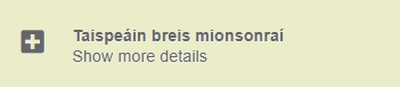
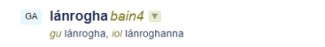

# Conas na torthaí cuardaigh a thuiscint

Liosta coincheap (nó iontrálacha) a bhíonn sna torthaí cuardaigh. Is éard is *Toradh beacht* ann ná iontráil ina bhfuil an teaghrán cuardaigh ar cheann de na téarmaí a thugtar ar an gcoincheap áirithe atá i gceist. Is éard is *Toradh gaolmhar* ann ná iontráil ina bhfuil an teaghrán cuardaigh mar chuid de théarma ilfhoclach.

## Leagan amach na hiontrála

Bíonn gach iontráil luaite le réimse. Bíonn an réimse (nó na réimsí) liostaithe ar dtús, os cionn fhearann na dtéarmaí. Bíonn eolas breise i dtaobh bhrí an choincheapa (mar shampla sainmhíniú agus sampla úsáide) liostaithe faoi bhun fhearann na dtéarmaí.

Bíonn hais ar thaobh na láimhe clé ag barr gach iontráil. Má chliceálann tú ar ar an hais seo tógfar thú chuig URL uathúil na hiontrála.

## Breis mionsonraí

Bíonn breis mionsonraí ag baint le roinnt iontrálacha, go hiondúil téarmaí eile a bhfuil stádas íseal inghlacthachta acu ar nós ‘in úsáid’ nó ‘dímholta’. Chun teacht ar na sonraí breise seo, cliceáil ar ‘Taispeáin breis mionsonraí’ ar thaobh na láimhe deise den scáileán.

Is féidir teacht ar na sonraí breise a bhaineann le hiontráil ar leith, má tá a leithéid ar fáil, ach cliceáil ar an gcros ar thaobh na láimhe deise ar barr.

## Leagan amach an téarma

Bíonn nod teanga roimh gach téarma. Faightear nod gramadaí (féach thíos) i ndiaidh téarmaí aonfhoclacha ach is féidir leis a bheith i lár nó ag deireadh téarmaí ilfhoclacha, ag brath ar an áit a bhuil príomhroinn chainte an téarma lonnaithe. Bíonn saighead anuas (féach thíos)  i ndiaidh gach téarma faoina bhfuil naisc chuig foinsí teanga eile mar aon le háis cóipeála agus greamaithe. Bíonn foirmeacha infhillte (féach thíos) liostaithe thíos faoin téarma.

### Noda gramadaí

Luaitear nod gramadaí le téarmaí go hiondúil. Giorrúchán beag atá i nod gramadaí a thugann le fios cén rann cainte lena mbaineann focal, mar shampla ainmfhocal nó aidiacht. Uaireanta tugtar faisnéis bhreise i nod gramadaí chomh maith, mar shampla an teanga as ar tháinig an focal (más focal iasachta é) nó faisnéis maidir le hinfhilleadh a bheith ar an bhfocal (mar shampla más focal san uimhir iolra atá ann).

Baintear úsáid as siombailí neamhaibítreacha i noda gramadaí chomh maith. Ciallaíonn ™ trádmharc agus ciallaíonn ® trádmharc cláraithe.

I gcás téarmaí ilfhoclacha, is minic nod gramadaí a bheith ceangailte le cuid den téarma, seachas leis an téarma iomlán. Mar shampla sa téarma **feirmeoireacht *bain3* mhonarchan**, baineann an nod *bain3* leis an bhfocal **feirmeoireacht** amháin. Nuair a chuireann tú cúrsóir na luchóige os cionn an noda, tagann aibhsiú ar an bhfocal lena mbaineann an nod (ní oibríonn sé seo ach i mbrabhsálaithe áirithe). Tá sé seo amhlaidh i gcás téarmaí Béarla chomh maith: cé go dtagann an nod gramadaí ag deireadh an téarma go minic (mar shampla **factory farming *s***), is leis an bhfocal deireanach amháin a bhaineann sé (**farming**), rud atá soiléir ón aibhsiú a thagann air tar éis an cúrsóir a chur os cionn an noda.

Is i bhfoirm giorrúchán a léirítear ranna cainte. Má chuireann tú cúrsóir na luchóige os cionn giorrúchán ar bith ar an scáileán, tiocfaidh bosca beag aníos agus míniú an ghiorrúcháin istigh ann.

<!--Is féidir liosta iomlán de ghiorrúcháin a fháil ach cliceáil anseo.-->

### Foirmeacha infhillte

Tugtar foirmeacha infhillte de théarmaí go minic, dála an tuisil ghinidigh ag ainmfhocail agus foirmeacha éagsúla de na briathra. Is mar chúnamh maidir le ceartúsáid na dtéarmaí i dtéacs atá siad ann, agus is le téarmaí Gaeilge a luaitear iad de ghnáth, seachas le téarmaí Béarla.

### Cliceáil ar théarmaí

Agus tú ag féachaint trí liosta na dtorthaí, is féidir leat cliceáil ar théarma ar bith, i dteanga ar bith. Is cuma cé acu cuardach tapa, cuardach casta nó brabhsáil réimsí atá ar siúl agat, nuair a chliceálann tú ar théarma, tugtar go dtí an cuardach tapa tú agus déantar cuardach ansin ar an téarma ar chliceáil tú air. Is bealach gasta é seo chun tuilleadh eolais i dtaobh téarma áirithe a fháil.

### Saighead anuas

Taispeántar saighead anuas i ndiaidh gach téarma Béarla agus Gaeilge - féach an léaráid thíos mar shampla. Má chliceáiltear ar an tsaighead seo, taispeánfar liosta nasc ónar féidir an téarma a chuardach i bhfoinsí eile Gaeilge. Bíonn na naisc seo ann fiú mura bhfuil fáil ar aon eolas faoin téarma sna foinsí sin. Os cionn na nasc úd tugtar leagan den téarma ar féidir é a chóipeáil agus a ghreamú go furasta.

Má chliceáiltear ar an tsaighead in aice le téarma Béarla, gheofar naisc chuig na suíomhanna foclóireachta, [foclóir.ie](https://www.focloir.ie/ga/) agus [teanglann.ie](https://www.teanglann.ie/ga/) chomh maith leis na hacmhainní corpais agus téarmaíochta atá ar [gaois.ie](https://www.gaois.ie/ga/).

Má chliceáiltear ar an tsaighead ag deireadh téarma Gaeilge, gheofar na foinsí thuasluaite go léir mar aon le foinse amháin eile, [Nua-Chorpas na hÉireann](http://corpas.focloir.ie/), ar corpas aonteangach téacsanna Gaeilge é.

