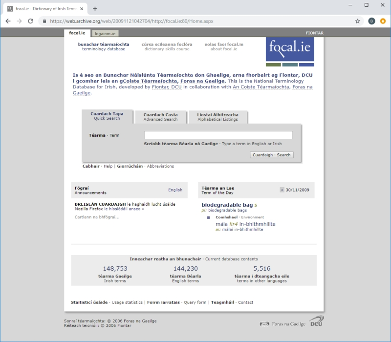

# The History of focal.ie/téarma.ie

## History of téarma.ie

www.focal.ie was founded in 2004 as a project within Fiontar (as it was called at the time), Dublin City University (DCU), in partnership with the University of Wales, Lampeter agus Foras na Gaeilge. ‘FIONTAR Téarmaí Unedig’ was the full title given to the project that lasted until 2007. The main objective of the project from Ireland’s point of view was to increase the general public’s access to information technology resources with a particular focus on high-level Irish language terminology resources. The main outcome of this project in Ireland was www.focal.ie (www.tearma.ie from March 1st 2015 onward), which was a comprehensive public database of new Irish language terminology.

FIONTAR Téarmaí Unedig was funded under the Communications agus Transport Technology fund (Priority 1, Measure 4) of the INTERREG IIIA Ireland/Wales programme. It was co-funded by Foras na Gaeilge and by Fiontar (through the Strategic Initiative Fund of the Higher Education Authority). 

The National Terminology Database for Irish project has been financed solely by Foras na Gaeilge since 2007. Under Phase II (2007-8), further material was added to the database, grammatical work was carried out on specific terms in order to bring them in line with the new rules of the Terminology Committee and Trade agus Technology terms were reviewed. Www.focal.ie won the European Prize for Languages, the Language Label in 2007 agus the prize for ‘Best Irish Language Site’ at the Irish Web Awards 2008.

Under Phase III (2008-11), more material was added to the database, including names of public bodies, countries, languages, plants agus animals. Usage examples were added to the database and system of hierarchy domains was developed. Work on a collection of sport terms also began as well as a new CD-ROM version of the database.

During Phase IV (2011-14), the database was linked with the New-Corpus for Ireland and a new hierarchy domain system was implemented throughout. As well as this, research was carried out on a major collection of art terms agus research was completed on the sport dictionary. A CD-ROM version of the database was published and a version for mobile devices was also developed, m.tearma.ie.

During Phase V (2014-17), a new collection of information technology terms was developed. The internet address of the National Terminology Database for Irish changed from focal.ie to tearma.ie on March 1st 2015.

Phase VI is now underway and as part of this work, **a new site along with a brand new editing system** were launched on March 13 2019. This system is based on **Terminologue** which is an open-source platform developed by Fiontar & Scoil na Gaeilge for the National Terminology Database for Irish. You can find out more about Terminologue [here](http://www.terminologue.org/).

