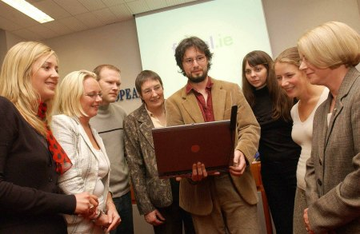
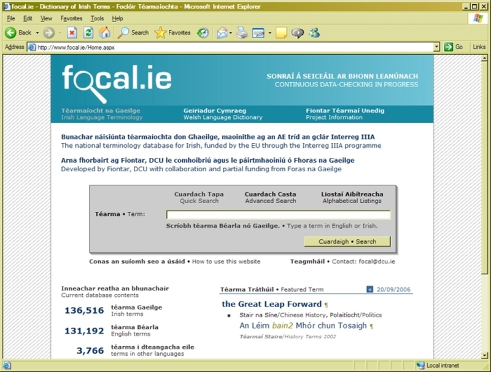
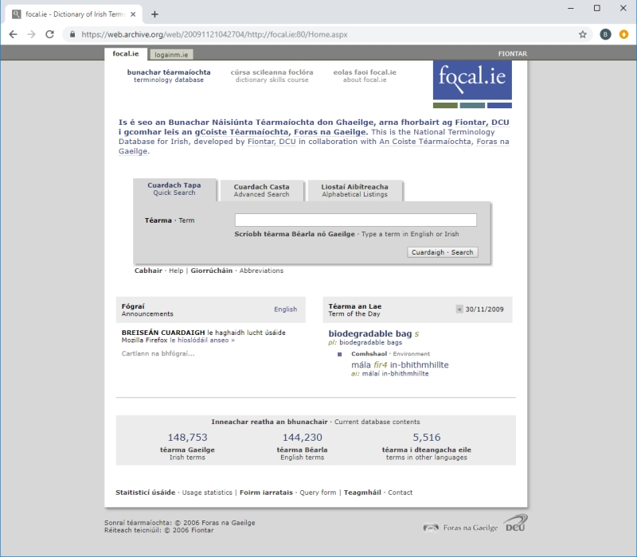
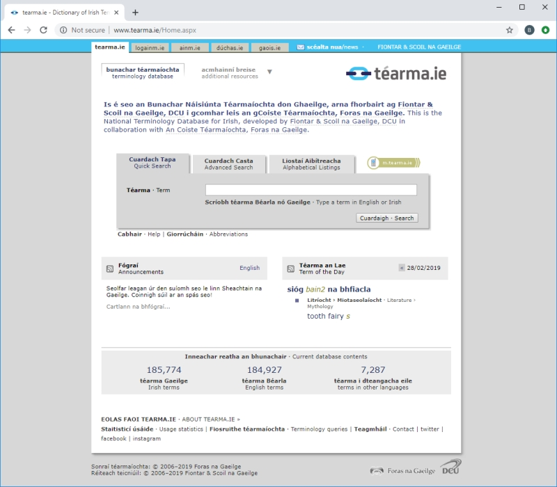
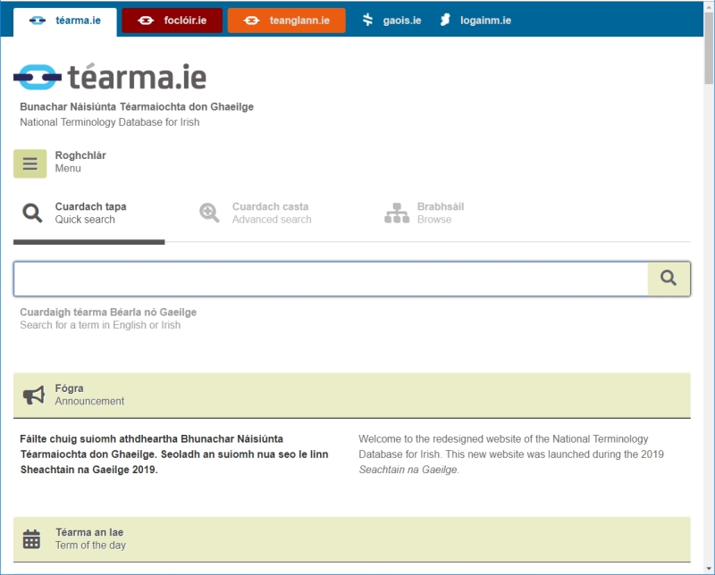

# Stair focal.ie/téarma.ie

## Stair téarma.ie

Bunaíodh www.focal.ie mar thionscadal de chuid Fiontar (mar a bhí), Ollscoil Chathair Bhaile Átha Cliath (DCU) i gcomhar le hOllscoil na Breataine Bige, Lampeter agus le Foras na Gaeilge. ‘FIONTAR Téarmaí Unedig’ an teideal iomlán a bhí ar an tionscadal seo, a mhair ó 2004 go 2007. Ba é príomhsprioc ghné na hÉireann den tionscadal ná méadú ar rochtain an ghnáthphobail ar acmhainní theicneolaíocht na faisnéise, sa chás seo acmhainní ardleibhéil téarmaíochta i nGaeilge. An príomhthoradh a bhí ar an tionscadal in Éirinn ná www.focal.ie (www.tearma.ie ón 1 Márta 2015), an bunachar cuimsitheach poiblí seo de nuathéarmaíocht na Gaeilge. 

Maoiníodh FIONTAR Téarmaí Unedig as an gciste *Cumarsáid Teicneolaíochta agus Iompair* (Tosaíocht 1, Beart 4) ag INTERREG IIIA Éire/An Bhreatain Bheag. Bhí an tionscadal á chómhaoiniú ag Foras na Gaeilge agus ag Fiontar (trí Chiste na dTionscnamh Straitéiseach ag an Údarás um Ard-Oideachas).

Tá tionscadal an Bhunachair Náisiúnta Téarmaíochta don Ghaeilge á mhaoiniú ag Foras na Gaeilge amháin ó 2007 i leith. Faoi Chéim II (2007-8) cuireadh tuilleadh ábhair leis an mbunachar, rinneadh obair ghramadaí ar théarmaí áirithe lena gcur de réir rialacha nua an Choiste Téarmaíochta, agus rinneadh athbhreithniú ar théarmaí ceirdeanna agus teicneolaíochta. Bhuaigh www.focal.ie an Duais Eorpach do Theangacha, An Lipéad Teanga, in 2007 agus an duais ‘An Suíomh Gaeilge is Fearr’ ag na Irish Web Awards 2008.  

Faoi Chéim III (2008-11) cuireadh tuilleadh ábhair leis an mbunachar, ainmneacha comhlachtaí poiblí, tíortha, teangacha, plandaí agus ainmhithe ina measc. Cuireadh samplaí úsáide leis an mbunachar chomh maith agus cuireadh tús le córas ordlathas réimsí a fhorbairt. Cuireadh tús le cnuasach nua téarmaí spóirt agus le leagan CD-ROM den bhunachar.

I rith Chéim IV (2011-14), ceanglaíodh an bunachar le Nua-Chorpas na hÉireann agus cuireadh ordlathas nua réimsí eolais i bhfeidhm tríd síos. Chomh maith leis sin, rinneadh taighde ar mhórbhailiúchán téarmaí ealaíon agus críochnaíodh an taighde ar an bhfoclóir spóirt. Foilsíodh leagan den bhunachar ar CD-ROM agus forbraíodh leagan do ghléasanna móibíleacha, m.tearma.ie.

I rith Chéim V (2014-17), forbraíodh cnuasach nua téarmaí teicneolaíochta faisnéise. Athraíodh seoladh idirlín an Bhunachair Náisiúnta Téarmaíochta don Ghaeilge ó *focal.ie* go *tearma.ie* ar an 1 Márta 2015.

Táthar anois i mbun chéim VI den tionscadal agus mar chuid den obair, seoladh **suíomh nua agus córas úrnua eagarthóireachta** ar an 13 Márta 2019. Tá an córas seo bunaithe ar **Terminologue**, ardán foinse oscailte a d’fhorbair Fiontar & Scoil na Gaeilge don Bhunachar Náisiúnta Téarmaíochta. Is féidir tuilleadh a fháil amach faoi Terminologue [anseo](http://www.terminologue.org/). 

