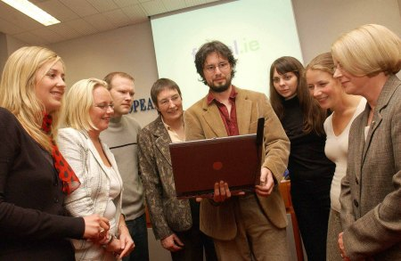

# Tionscadal téarma.ie

Seo é an bunachar náisiúnta téarmaíochta don Ghaeilge a d’fhorbair [Fiontar & Scoil na Gaeilge](https://www.gaois.ie/) i gcomhpháirt leis an gCoiste Téarmaíochta, Foras na Gaeilge.

Tá os cionn 373,000 téarma ar fáil sa bhunachar agus iad inchuardaithe faoi na leaganacha Gaeilge agus Béarla. Bhain os cionn 5.1 milliún cuairteoir uathúla leas as an suíomh idir 2006 agus tús 2018. Thug na daoine sin 17.9 milliún cuairt ar an suíomh agus rinne siad breis is 87.6 milliún cuardach lena linn sin. De réir suirbhéanna úsáideoirí bliantúla a rinne Fiontar & Scoil na Gaeilge ó 2010 i leith, is aistritheoirí agus ateangairí mar aon le mic léinn ollscoile is mó a bhaineann úsáid as an suíomh.

## Céim reatha: Céim VI 2017-2020

Cuireadh tús le céim VI den tionscadal ar an 1 Meitheamh 2017 agus, i measc nithe eile, tá sé i gceist córais nua eagarthóireachta agus suíomh nua a fhorbairt.

